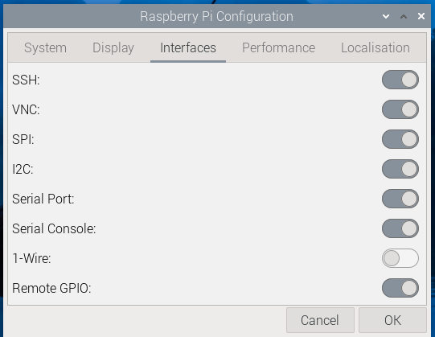

# rpi headless setup
* installed recommended OS (64-bit Raspbian). supplied wifi network name and pw so pi will connect to wifi on boot.
* set custom username/hostname.
```bash
$ uname -a
Linux pragpiv4b 6.6.20+rpt-rpi-v8 #1 SMP PREEMPT Debian 1:6.6.20-1+rpt1 (2024-03-07) aarch64 GNU/Linux
```

* logged into pi via ssh (enabled by default)
* installed vnc using command ` sudo apt-get install realvnc-vnc-server`
* downloaded real vnc viewer on my own pc
* used pi headless through vnc after this.
* go to "Raspberry Pi Configuration" and enable all interfaces


# rpi SPI control
[https://www.raspberrypi.com/documentation/computers/raspberry-pi.html#software](https://www.raspberrypi.com/documentation/computers/raspberry-pi.html#serial-peripheral-interface-spi)

1. check SPI 0 and 1 is enabled @ boot by checking `/boot/firmware/config.txt`

    ```
    # NOTE: check for this line
    dtparam=spi=on
    # NOTE: add this line if it doesn't exist
    dtoverlay=spi1-1cs # enable auxiliary SPI with 1 chip select
    ```
1. give full control of spi files - run following commands:
    ```
    sudo chmod 777 /dev/spidev*
    ls -al /dev | grep spi
    ```
    output should be
    ```
    crwxrwxrwx   1 root spi     153,   0 Mar 25 00:17 spidev0.0
    crwxrwxrwx   1 root spi     153,   1 Mar 25 00:17 spidev0.1
    ```
